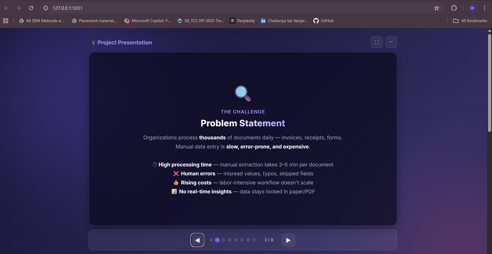
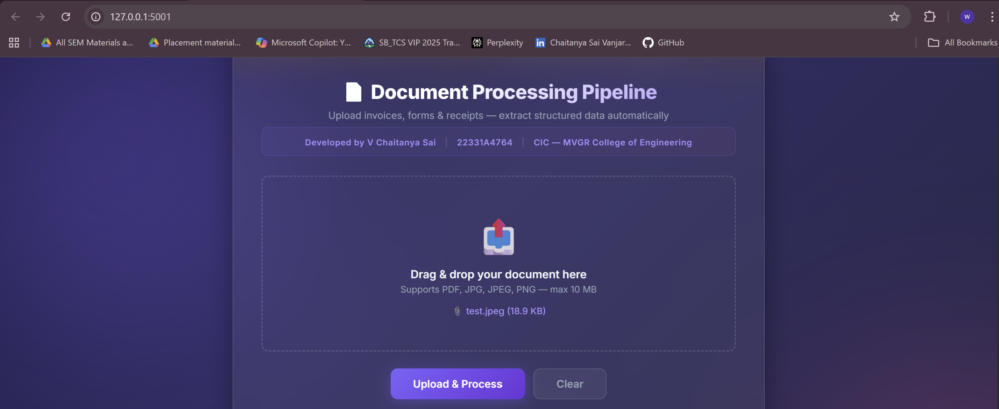
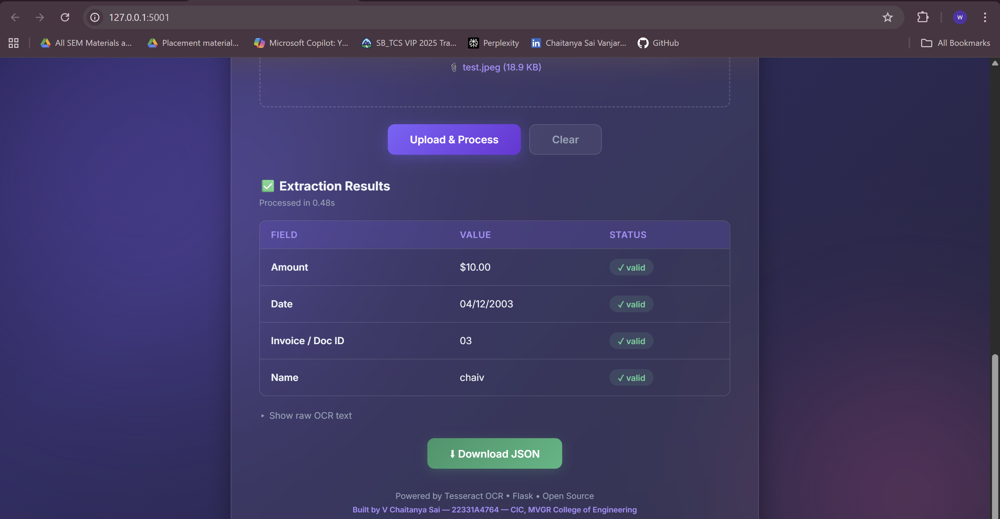

# 📄 Automated Document Processing Pipeline

> An intelligent, OCR-powered pipeline that extracts structured data from invoices, forms, and receipts — **100% free, no paid APIs required.**

**Developed by V Chaitanya Sai | 22331A4764 | CIC — MVGR College of Engineering**

[](https://python.org)
[](https://flask.palletsprojects.com)
[](https://github.com/tesseract-ocr/tesseract)


---


## 🔍 What Is This?

This project is a full-stack web application that:

- **Accepts** PDF or image files (invoices, forms, receipts)
- **Extracts** raw text using Tesseract OCR
- **Parses** structured fields — Name, Amount, Date, Invoice ID — using regex
- **Validates** the extracted data and returns a clean JSON response
- **Displays** results live in the browser with field-level validation status

**Real-World Example:**

```
INPUT:  invoice.pdf
   ↓
OCR:    "INVOICE\nInvoice #: INV-2024-001\nDate: 03/18/2024\nBill To: Kusuma Kumar\nTotal: $1,500.00"
   ↓
PARSE:  Name → "Kusuma Kumar"  |  Amount → $1500.00  |  Date → 03/18/2024  |  ID → INV-2024-001
   ↓
OUTPUT: { "status": "success", "data": { ... }, "validation": { ... } }
```

---

## 🚀 Live Demo

> **Deployed URL:** `https://automated-document-processing-pipeline.onrender.com`

---
## Inputs

## Outputs


## 🏗️ Complete System Architecture

```
┌──────────────────────────────────────────────────────────┐